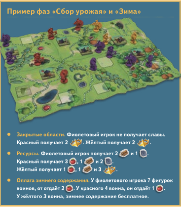

### 1.0.0



### description
NLP RAG project based on PDF files table game tutorial.
game "Нордгард: Новые земли"

### prerequisites
```bash
git clone https://github.com/AxmetES/nlp-rag-project.git
``` 

### add .env

example:
```bash
OPENAI_API_KEY=your_openai_api_key
BOT_TOKEN=your_bot_token
```
### run docker compose build
```bash
docker-compose up --build
```
### 2 API:
when FastAPI starts, vectordb will be created and filled with data from pdf files.

1 - http://localhost:8000/health

```response
{
    "status": "ok",
    "ts": 1772712580
}
```

2 - http://localhost:8000/v1/chat

```request
{
    "chat_id": "1", 
    "question": "а как же руны ?"
}
```

```response
{
    "answer": "В настольной игре НОРДГАРД: НОВЫЕ ЗЕМЛИ руны играют важную роль, но в контексте вашего вопроса о 
    ресурсах они не являются отдельным ресурсом. Вместо этого руны могут быть связаны с определенными действиями
    или строительством, например, в ячейках для рунного камня. \n\nЕсли у вас есть дополнительные вопросы о рунах
    или их использовании в игре, пожалуйста, уточните!",
    "model": "gpt-4o-mini"
}
```